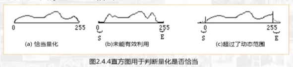
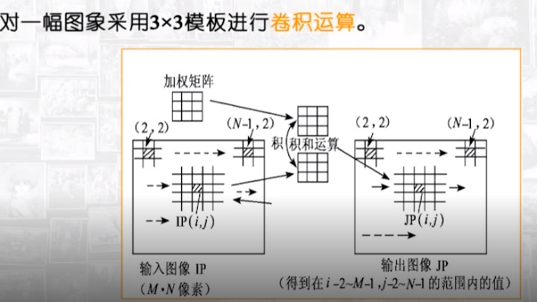
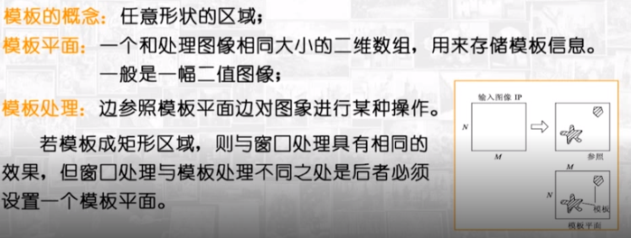
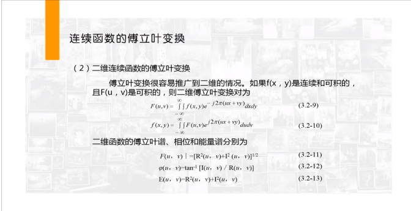
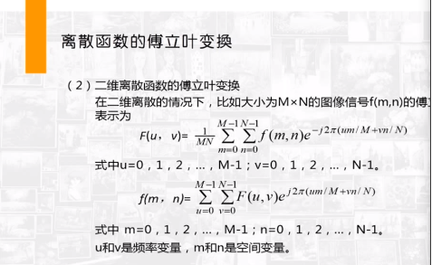

# 数字图像处理

## 课程地址

https://www.icourse163.org/course/WHU-1002332010

http://tools.antlm.com/

http://mooc1.mooc.whu.edu.cn/course/200029111.html#courseResc

## 图像数字化

- **像素**的属性：位置，颜色，灰度
- **图像分辨率**:每英寸图像内的像素点数(单位：像素/英寸 ppi)
- 空间分辨率：图像可辨认的临界物体空间几何长度的最小极限
- 幅度分辨率:幅度分辨率是指幅度离散，每个像素都有一个强度值，称该像素的灰度，一般量化采用8bit。例如8bit的灰度级为2的八次方即256
- 存储图像所需要的位数b：b=MxNxK      MxN是空间分辨率 ；K幅度分辨率，单位是bit、
- **对比度**：指一幅图中灰度反差的大小，对比度 =  最大亮度/最小亮度

- **二值图像**：图像的每个像素只能是黑色或者白色，没有中间的过渡。二值图像的像素值为0（白）或者1（黑色）

  - 二值化：	

    ```
    1、取阀值为127（相当于0~255的中数，（0+255）/2=127），让灰度值小于等于127的变 为0（黑色），灰度值大于127的变为255（白色），这样做的好处是计算量小速度快，但是 缺点也是很明显的，因为这个阀值在不同的图片中均为127，但是不同的图片，他们的颜色分布差别很大，所以用127做阀值，白菜萝卜一刀切，效果肯定是不好的。
    
    2、计算像素点矩阵中的所有像素点的灰度值的平均值avg
    
    （像素点1灰度值+...+像素点n灰度值）/ n = 像素点平均值avg，然后让每一个像素点与avg一 一比较，小于等于avg的像素点就为0（黑色），大于avg的 像 素点为255（白色），这样做比方法1好一些。
    
    3、使用直方图方法（也叫双峰法）来寻找二值化阀值，直方图是图像的重要特质。直方图方法 认为图像由前景和背景组成，在灰度直方图上，前景和背景都形成高峰，在双峰之间的最低谷处就是阀值所在。取到阀值之后再一 一比较就可以了
    //reference:https://blog.csdn.net/Strive_0902/article/details/78023080
    ```

- **灰度图像**：每个像素的信息由一个量化的灰度来描述图像，没有彩色信息。字节（8位）可表示256级的灰度[0-255]

  - **灰度**是表明图像明暗的数值，即黑白图像中点的颜色深度，范围一般从0到255，白色为255 ，黑色为0，故黑白图片也称灰度图像。灰度值指的是单个像素点的亮度。灰度值越大表示越亮。

- **彩色图像**：每个像素是由R,G，B分量构成的图像，其中R,G,B是由不同的灰度级来描述。3字节（24位）可表示一个像素。

- 灰度级:图像中不同灰度的最大数量。灰度级越大，图像的亮度范围越大。

- 数字化
  - 采样
  - 量化

## 图像灰度直方图

图像的灰度化：使得RGB色彩分量全部相等，即R=B=G，此时的这个值叫做**灰度值**

**灰度化处理**:

```
1.浮点算法：Gray=R*0.3+G*0.59+B*0.11                R=G=B

2.整数方法：Gray=(R*30+G*59+B*11)/100              R=G=B

3.移位方法：Gray =(R*28+G*151+B*77)>>8            R=G=B

4.平均值法：Gray=（R+G+B）/3                            R=G=B

5.仅取绿色：Gray=G                                              R=G=B
//reference:https://blog.csdn.net/Strive_0902/article/details/78023080
```

- **图像灰度直方图**： 反应一幅图像中各灰度级像素出现的频率与灰度级的关系。以灰度级为横坐标，频率为纵坐标，绘制频率同灰度级的关系图就是一幅**灰度图像的直方图**，**它反应了图像灰度分布的状况**

  ```
  频率计算公式：vi = ni/n
  ```

- 彩色图像有三个分量的直方图（RGB）

- 性质：

  - 丢失了像素的位置信息
  - 一幅图像只有唯一的灰度直方图，反之不成立
  - 一幅图像分成多个区域，多个区域直方图之和即为原图像的直方图

- 应用：

  - 判断图像量化是否恰当

    

  - 用于确定图像二值化的阈值（双峰法）

# 图像处理算法形式

**领域**：对于任意像素（i，j),该像素周围的像素构成的集合{(i+p,j+q),p,q取合适的整数 }，叫做该像素的邻域

**局部处理**：对输入图像IP(i , j) 处理时，某一输出像素JP(i , j) 值由输入图像中的像素及其邻域 N( IP （i ， j）)中的像素值确定。这种处理成为局部处理

例子：卷积计算



点处理

大局处理

迭代处理:反复对图像进行某种运算，直到满足某个条件

跟踪处理

**窗口处理**：对图像中选定的矩形区域内的像素进行处理的方式

模板处理:单独处理任意形状的区域，



串行处理

## 图像的数据结构与文件格式

- 数据结构：图像按照灰度值的存储方式，常用方式是将图像各像素灰度值用一维或二维数组相应的各元素加以存储

  -  组合方式
  - 比特面方式
  - 分层结构
  - 树结构
  - 多重图像数据存储
- 按照不同的方式组织存储数字图像像素的灰度，就得到不同格式的图像文件

## 图像变换

- 图像变换通常是二维正交变换，可逆
- 正交变换的特点：在变换域上图像能量将集中分布在低频率成分上，边缘、线状信息反映在高频率成分上，有利于图像处理
- 傅里叶变换：傅里叶级数->傅里叶级数表明了信号由哪些频率分量组成及其所占的比重，有利于对信号进行分析与处理
- 二维连续函数的傅里叶变换
  - 

- 二维离散函数的傅里叶变换

  

