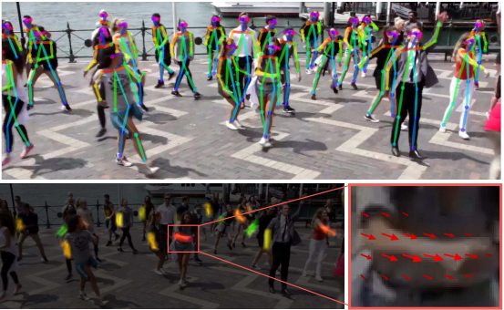
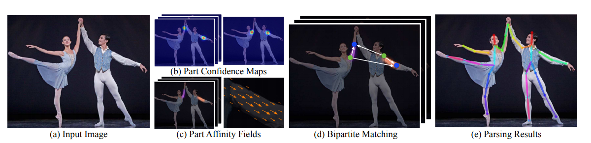
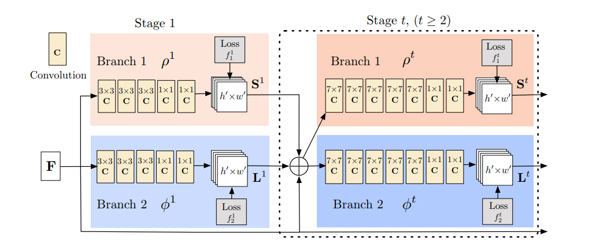
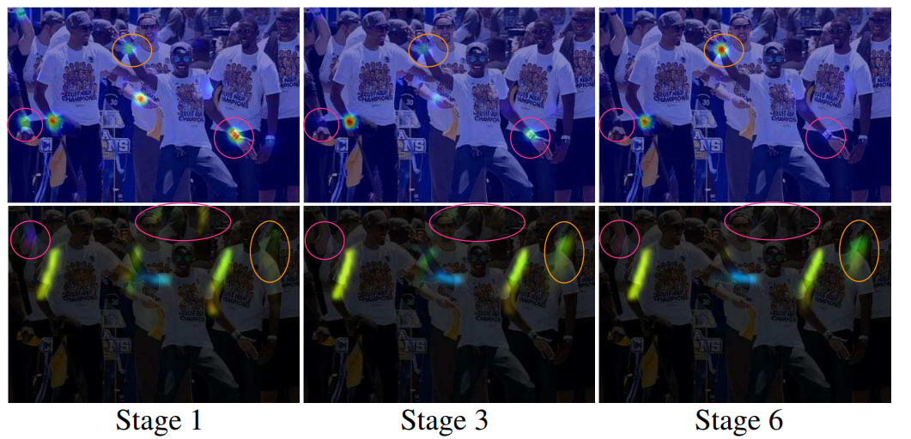
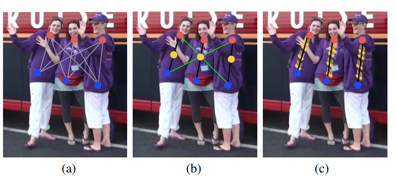

# openpose

## [论文](openpose.pdf)

## [实现代码](https://github.com/ZheC/Realtime_Multi-Person_Pose_Estimation)

## 中文翻译

## Abstract

我们提出了一种有效检测多人图像中的2D姿势的方法。 该方法使用非参数表示，我们称之为部分亲和力

字段（PAF），用于学习将图像中的身体部位与个体联系起来。 该体系结构编码全局上下文，允许贪婪的自下而上解析步骤，无论图像中的人数多少，同时实现高精度和实时性能。 架构旨在将学习关节点和关节点之间的连接融合起来，通过相同顺序的两个分支进行关联预测。 

## 1. Introduction

人体2D姿势估计 - 本地化的问题解剖学关键点或“部分” - 主要集中于找到个体的身体部位[8,4,3,21,33,13,25,31，6,24].特别是在图像中推断出多个人的姿势，呈现出一套独特的风格挑战。 首先，每个图像可能包含可以在任何位置或规模发生未知 数量的人。其次，人与人之间的互动导致复杂的空间干扰，由于接触，闭塞和肢体关节，使部件关联变得困难。 第三，运行时随着人口数量的增加，复杂性趋于增长，使实时性能成为一项挑战。

*Figure 1.顶部：多人姿势估计。 同一个人的身体部位之间用线相连。 左下：部分亲和力字段（PAFs）对应于连接右肘和右侧的肢体腕。 颜色编码方向。 右下：放大预测的PAF的视图。 在场中的每个像素处，2D矢量编码四肢的位置和方向。*

------------------------------------------------------------------------

[^Video result]: https://youtu.be/pW6nZXeWlGM

采用一种常见的方法[23,9,27,12,19]人检测器并执行单人姿势估计对于每次检测。 这些自上而下的方法直接利用现有技术进行单人姿势估计[17,11,18,28,29,7,30,5,6,20]，但受苦从早期承诺：如果人员检测器失败 - 因为它当人们近在咫尺时很容易检测不出来，这种情况无法检测。 而且，这些自上而下方法的运行时间与人数成正比：对于每次检测，人数越多，单人姿势估计器计算量成本越大。相比之下，自下而上的方法很有吸引力,因为它们为早期承诺提供了稳健性并且拥有将运行时复杂性与图像中的人数之间关系分离。然而，自下而上的方法却没有直接使用来自其他身体部位和其他人的全局上下文线索。在实践中，以前的自下而上的方法[22,11]不会保留效率的提升，以至于最终的解析需要昂贵的全局推理。例如，Pishchulin等人的开创性工作。 [22]提出了自下而上的建议：联合标记部分检测候选者的方法将它们与个人联系起来。但是，在一个完全连接的图上解决整数线性规划问题一个NP问题和平均处理时间大约是几个小时。 Insafutdinov等。 [11]建成[22]基于ResNet的更强部分探测器[10]和图像相关的成对分数，并大大改善运行时，但该方法在限制部分提案的数量的情况下处理一张图片仍然需要几分钟。[11]中使用的成对表示很难回归,因此，需要一个单独的逻辑回归。

*Figure 2.整体过程。 我们将整个图像作为双分支CNN的输入来联合预测置信图,（b）中所示的身体部位检测，以及（c）中所示的部位关联的部分亲和力字段。 解析步骤执行一组二分匹配身体部位候选人的匹配（d）。 我们最终将它们组装成图像中所有人的全身姿势（e）。*

 在本文中，我们首次提出一种自下而上描述关联分数的方法：Part Affinity Fields（PAF），PAF是一组对位置和图像上肢体的方向进行编码的2D矢量场。 我们证明同时推断这些自下而上的检测和关联表示足以很好地编码全局上下文，以一小部分计算成本获得高质量的结果。我们公开发布了完全可重复性的[代码](https://github.com/ZheC/Realtime_Multi-Person_Pose_Estimation)，呈现 第一个用于多人2D姿势检测的实时系统。

## 2.Method

Figure 2说明了我们方法的整个流水线。 该系统采用尺寸为w×h的彩色图像作为输入（Fig.2a），并且为图像中的每个人产生解剖关键点的2D位置作为输出（Fig.2e）。 首先，前向网络同时预测一组身体部位位置的2D置信度图S（Fig.2b）和编码一组身体部分之间关联程度(亲和度)的2D矢量场L（图2c）。 集合S =（$S_1$，$S_2$，...，$S_J$）具有J个置信图，每个部分一个，其中$S_j$∈${R}^{w * h}$，j∈${\{1...J\}}$。 集合L =（$L_1$，$L_2$，...，$L_C$）具有C个矢量场，每个肢体1个，其中$L_c$∈$R^{w×h×2}$，$c∈\{1.. C\}​$，Lc中的每个图像位置编码2D矢量（如Fig.1所示）。 最后，通过贪心推理（Fig.2d）解析置信度图和亲和度字段，以输出图像中所有人的2D关键点。

### 2.1. Simultaneous Detection and Association

我们的架构 Fig.3所示，同时预测检测编码的置信度图和亲和力字段（身体部位之间的关联）。 网络分为两部分分支：以米色显示的顶部分支预测置信度图和以蓝色显示的底部分支预测亲和领域。每个分支都是一个迭代预测架构。在Wei等人的基础上改进了连续阶段的预测，Wei等人采取的是$t∈\{1 ,... ，T\}$，每个阶段要用中间监督。

*Figure 3.双分支多级CNN的体系结构。 每第一个分支中的阶段预测置信度图 ${S}^{t}$，每一个*
*第二个分支中的阶段预测PAFs  $L^t$。 每个阶段之后，来自两个分支的预测，以及图像特征，进行连接进入下一阶段。*

首先通过卷积网络分析图像（由前10层VGG-19 [26]初始化并经过微调），生成一组特征映射F 作为每个分支的第一阶段的输入。 在第一阶段，网络产生一组检测置信度图$S^{1}$ = ${\rho}^{1}(F)$和一组部分亲和力字段$L^{1}={\phi}^{1}(F)$,
其中$\rho^{1}$和${\phi}^{1}$是第1阶段推断的CNN。在随后的每一个中阶段，来自前两个分支阶段的预测结果，以及原始图像特征F，是连接并用于产生更精确的预测。

$S^{t}={\rho}^{t}(F,S^{t-1},L^{t-1}), {\forall}t{\ge2}$                              (1)

${L}^{t}={\phi}^{t}(F,S^{t-1},L^{t-1}), {\forall}t{\ge2}$                             (2)

$\rho^{t}$和$\phi^{t}$ 是第t阶段的CNN。

图4显示了各阶段置信图和亲和力领域的优化。 

为了引导神经网络以迭代方式在分支一预测身体部位的置信度图和在第二个分支预测PAF，我们在每个阶段结束时应用了两个损失函数，每个分支一个。我们在估计的预测值和真实的关节图，关节连接之间使用L2损失。 **在这里，我们在空间上对损失函数进行加权，以解决一些实际问题，即某些数据集并未完全标记所有人。**

---------------------------------------

 1为了清晰起见，我们将部件对称为肢体，尽管有些对不是人的肢体（例如，脸）。

*Figure 4.各个阶段的右手腕（第一排）和PAF的置信度图（第二排）右前臂。 虽然在早期阶段左右身体部位和四肢之间经常会混乱，但是通过后期阶段的全面推理，预测越来越精确，如图中高亮区域所示。*

特别地，第t阶段的两个损失函数如下:

$f_{S}^{t}=\sum_{j=1}^{J}\sum_{p}{W(p)\bullet\Arrowvert{S_{j}^t(p) - S_j^*(p)}\Arrowvert}_2^2$                      (3)

${f}_{L}^{t}=\sum_{c=1}^{C}\sum_{p}{W(p)\bullet\Arrowvert{L_{c}^t(p) - L_c^*(p)}\Arrowvert}_2^2$                      (4)

$S_j^*$是真实的身体部位置信图$L_c^*$是真实的身体关节连接向量，W(p)是一个二进制位，当这个关节p并没有在图像上显示的时候，W(p) = 0 . W(p)的目的是避免在训练过程中惩罚真实情况的预测。每个阶段的中间监督是通过周期性的调整梯度来解决梯度消失问题，总体的表示如下：

$f = \sum_{t =1}^T(f_S^t + f_S^t)$                                                                 (5)

### 2.2. Confidence Maps for Part Detection

为了在训练过程中评估公式（5）中的$f_s$，我们从标注的2D关键点中生成了真实的置信图$S^*$ 。每个置信图是一个特定身体部位在每个像素点发生的可能性。理想情况下，如果图像中只有一个人，在每个置信图中应该只有一个峰值，如果对应的身体部位在图像上是可见的话；如果图像上有多个人，应该会有一个对应每个人$k$的每一个可见的身体部位$j$的峰值。

我们首先对每个人$k$生成了个人的所有置信图 $S_{j,k}^*$ 。$x_{j,k}\in{R}^2$ 为第k个人的身体部位j对应的真实位置，位置$p\in{R}^2$ 在置信图$S_{j,k}^*$中的值为，

$S_{j,k}^*(p) = exp(-\frac {{\parallel}p-x_{j,k}{\parallel}_2^2} {\sigma^2} )$                                                         (6)

Figure 5.身体部位关联策略。(a)两个不同身体部位检测候选点（红色和蓝色点）和它们之间的全部连接（灰色的线）（b）连接结果用中间点（黄色的点）表示：正确的连接（黑色的线）和满足发生率约束的不正确的连接（绿色的线）（c）结果使用PAFs（黄色的箭头），通过编码肢体的位置和方向，PAFs消除了错误的连接。

     

## 笔记

[框架结构](https://blog.csdn.net/qq_36165459/article/details/78322184)

### Hungarian algorithm

## 代码

## 资料

[相关git仓库]()

## 问题

Hungarian algorithm算法具体内容？

研究，fine tune openpose code

**在这里，我们在空间上对损失函数进行加权，以解决一些实际问题，即某些数据集并未完全标记所有人。**？？？