# openpose

## [论文](openpose.pdf)

## [实现代码](https://github.com/ZheC/Realtime_Multi-Person_Pose_Estimation)

## [中文翻译](openpose_zh_CN.pdf)

## Abstract

我们提出了一种有效检测多人图像中的2D姿势的方法。 该方法使用非参数表示，我们称之为部分亲和力

字段（PAF），用于学习将图像中的身体部位与个体联系起来。 该体系结构编码全局上下文，允许贪婪的自下而上解析步骤，无论图像中的人数多少，同时实现高精度和实时性能。 架构旨在将学习关节点和关节点之间的连接融合起来，通过相同顺序的两个分支进行关联预测。 

## 1. Introduction

人体2D姿势估计 - 本地化的问题解剖学关键点或“部分” - 主要集中于找到个体的身体部位[8,4,3,21,33,13,25,31，6,24].特别是在图像中推断出多个人的姿势，呈现出一套独特的风格挑战。 首先，每个图像可能包含可以在任何位置或规模发生未知 数量的人。其次，人与人之间的互动导致复杂的空间干扰，由于接触，闭塞和肢体关节，使部件关联变得困难。 第三，运行时随着人口数量的增加，复杂性趋于增长，使实时性能成为一项挑战。

*Figure 1.顶部：多人姿势估计。 同一个人的身体部位之间用线相连。 左下：部分亲和力字段（PAFs）对应于连接右肘和右侧的肢体腕。 颜色编码方向。 右下：放大预测的PAF的视图。 在场中的每个像素处，2D矢量编码四肢的位置和方向。*

------------------------------------------------------------------------

[^Video result]: https://youtu.be/pW6nZXeWlGM

采用一种常见的方法[23,9,27,12,19]人检测器并执行单人姿势估计对于每次检测。 这些自上而下的方法直接利用现有技术进行单人姿势估计[17,11,18,28,29,7,30,5,6,20]，但受苦从早期承诺：如果人员检测器失败 - 因为它当人们近在咫尺时很容易检测不出来，这种情况无法检测。 而且，这些自上而下方法的运行时间与人数成正比：对于每次检测，人数越多，单人姿势估计器计算量成本越大。相比之下，自下而上的方法很有吸引力,因为它们为早期承诺提供了稳健性并且拥有将运行时复杂性与图像中的人数之间关系分离。然而，自下而上的方法却没有直接使用来自其他身体部位和其他人的全局上下文线索。在实践中，以前的自下而上的方法[22,11]不会保留效率的提升，以至于最终的解析需要昂贵的全局推理。例如，Pishchulin等人的开创性工作。 [22]提出了自下而上的建议：联合标记部分检测候选者的方法将它们与个人联系起来。但是，在一个完全连接的图上解决整数线性规划问题一个NP问题和平均处理时间大约是几个小时。 Insafutdinov等。 [11]建成[22]基于ResNet的更强部分探测器[10]和图像相关的成对分数，并大大改善运行时，但该方法在限制部分提案的数量的情况下处理一张图片仍然需要几分钟。[11]中使用的成对表示很难回归,因此，需要一个单独的逻辑回归。

*Figure 2.整体过程。 我们将整个图像作为双分支CNN的输入来联合预测置信图,（b）中所示的身体部位检测，以及（c）中所示的部位关联的部分亲和力字段。 解析步骤执行一组二分匹配身体部位候选人的匹配（d）。 我们最终将它们组装成图像中所有人的全身姿势（e）。*

 在本文中，我们首次提出一种自下而上描述关联分数的方法：Part Affinity Fields（PAF），PAF是一组对位置和图像上肢体的方向进行编码的2D矢量场。 我们证明同时推断这些自下而上的检测和关联表示足以很好地编码全局上下文，以一小部分计算成本获得高质量的结果。我们公开发布了完全可重复性的[代码](https://github.com/ZheC/Realtime_Multi-Person_Pose_Estimation)，呈现 第一个用于多人2D姿势检测的实时系统。

## 2.Method

Figure 2说明了我们方法的整个流水线。 该系统采用尺寸为w×h的彩色图像作为输入（Fig.2a），并且为图像中的每个人产生解剖关键点的2D位置作为输出（Fig.2e）。 首先，前向网络同时预测一组身体部位位置的2D置信度图S（Fig.2b）和编码一组身体部分之间关联程度(亲和度)的2D矢量场L（图2c）。 集合S =（$S_1$，$S_2$，...，$S_J$）具有J个置信图，每个部分一个，其中$S_j$∈${R}^{w * h}$，j∈${\{1...J\}}$。 集合L =（$L_1$，$L_2$，...，$L_C$）具有C个矢量场，每个肢体1个，其中$L_c$∈$R^{w×h×2}$，$c∈\{1.. C\}​$，Lc中的每个图像位置编码2D矢量（如Fig.1所示）。 最后，通过贪心推理（Fig.2d）解析置信度图和亲和度字段，以输出图像中所有人的2D关键点。

### 2.1. Simultaneous Detection and Association

我们的架构 Fig.3所示，同时预测检测编码的置信度图和亲和力字段（身体部位之间的关联）。 网络分为两部分分支：以米色显示的顶部分支预测置信度图和以蓝色显示的底部分支预测亲和领域。每个分支都是一个迭代预测架构。在Wei等人的基础上改进了连续阶段的预测，Wei等人采取的是$t∈\{1 ,... ，T\}$，每个阶段要用中间监督。

*Figure 3.双分支多级CNN的体系结构。 每第一个分支中的阶段预测置信度图 ${S}^{t}$，每一个*
*第二个分支中的阶段预测PAFs  $L^t$。 每个阶段之后，来自两个分支的预测，以及图像特征，进行连接进入下一阶段。*

首先通过卷积网络分析图像（由前10层VGG-19 [26]初始化并经过微调），生成一组特征映射F 作为每个分支的第一阶段的输入。 在第一阶段，网络产生一组检测置信度图$S^{1}$ = ${\rho}^{1}(F)$和一组部分亲和力字段$L^{1}={\phi}^{1}(F)$,
其中$\rho^{1}$和${\phi}^{1}$是第1阶段推断的CNN。在随后的每一个中阶段，来自前两个分支阶段的预测结果，以及原始图像特征F，是连接并用于产生更精确的预测。

$S^{t}={\rho}^{t}(F,S^{t-1},L^{t-1}), {\forall}t{\ge2}$                              (1)

${L}^{t}={\phi}^{t}(F,S^{t-1},L^{t-1}), {\forall}t{\ge2}$                             (2)

$\rho^{t}$和$\phi^{t}$ 是第t阶段的CNN。

图4显示了各阶段置信图和亲和力领域的优化。 

为了引导神经网络以迭代方式在分支一预测身体部位的置信度图和在第二个分支预测PAF，我们在每个阶段结束时应用了两个损失函数，每个分支一个。我们在估计的预测值和真实的关节图，关节连接之间使用L2损失。 **在这里，我们在空间上对损失函数进行加权，以解决一些实际问题，即某些数据集并未完全标记所有人。**

---------------------------------------

 1为了清晰起见，我们将部件对称为肢体，尽管有些对不是人的肢体（例如，脸）。

*Figure 4.各个阶段的右手腕（第一排）和PAF的置信度图（第二排）右前臂。 虽然在早期阶段左右身体部位和四肢之间经常会混乱，但是通过后期阶段的全面推理，预测越来越精确，如图中高亮区域所示。*

特别地，第t阶段的两个损失函数如下:

$f_{S}^{t}=\sum_{j=1}^{J}\sum_{p}{W(p)\bullet\Arrowvert{S_{j}^t(p) - S_j^*(p)}\Arrowvert}_2^2$                      (3)

${f}_{L}^{t}=\sum_{c=1}^{C}\sum_{p}{W(p)\bullet\Arrowvert{L_{c}^t(p) - L_c^*(p)}\Arrowvert}_2^2$                      (4)

$S_j^*$是真实的身体部位置信图$L_c^*$是真实的身体关节连接向量，W(p)是一个二进制位，当这个关节p并没有在图像上显示的时候，W(p) = 0 . W(p)的目的是避免在训练过程中惩罚真实情况的预测。每个阶段的中间监督是通过周期性的调整梯度来解决梯度消失问题，总体的表示如下：

$f = \sum_{t =1}^T(f_S^t + f_S^t)$                                                                 (5)

### 2.2. Confidence Maps for Part Detection

为了在训练过程中评估公式（5）中的$f_s$，我们从标注的2D关键点中生成了真实的置信图$S^*$ 。每个置信图是一个特定身体部位在每个像素点发生的可能性。理想情况下，如果图像中只有一个人，在每个置信图中应该只有一个峰值，如果对应的身体部位在图像上是可见的话；如果图像上有多个人，应该会有一个对应每个人$k$的每一个可见的身体部位$j$的峰值。

我们首先对每个人$k$生成了个人的所有置信图 $S_{j,k}^*$ 。$x_{j,k}\in{R}^2$ 为第k个人的身体部位j对应的真实位置，位置$p\in{R}^2$ 在置信图$S_{j,k}^*$中的值为，

$S_{j,k}^*(p) = exp(-\frac {{\parallel}p-x_{j,k}{\parallel}_2^2} {\sigma^2} )$                                                         (6)

*Figure 5.身体部位关联策略。(a)两个不同身体部位检测候选点（红色和蓝色点）和它们之间的全部连接（灰色的线）（b）连接结果用中间点（黄色的点）表示：正确的连接（黑色的线）和满足发生率约束的不正确的连接（绿色的线）（c）结果使用PAFs（黄色的箭头），通过编码肢体的位置和方向，PAFs消除了错误的连接。*

$\sigma$控制置信图峰的范围。网络要预测的真实的置信图是独立的置信图通过取最大运算得到的聚合。

$S_{j,k}^*(p) = \max_kS_{j,k}^*(p)$                                                        (7)

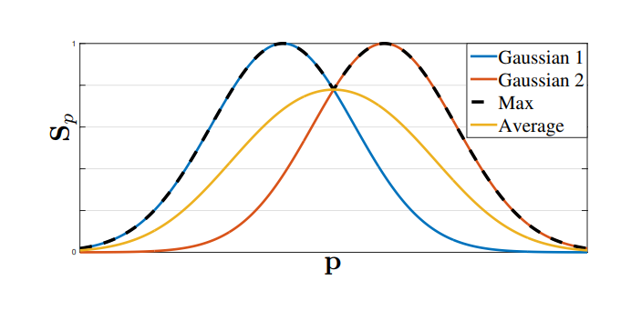

我们取置信图中最大的部分而不是取平均，使得靠近峰值的预测会很明显，就像上图所示。在测试的时候，我们预测置信图（在Figure 4.中的第一行），通过非最大值抑制得到身体部位的候选。

### 2.3. Part Affinity Fields for Part Association

给出一组检测到的身体部位（就像Figure 5a中的红色和蓝色点），我们如何把它们组装成若干个人的完整身体姿态呢？我们需要对每个身体部分的连接进行一个可能性测量，也就是保证它们属于同一个人。一种可能的检测连接的方法是检测每对身体部位之间的肢体的中间点，并检查它在候选身体部位之间发生的可能性，如Figure 5b所示。然而当人们挤在一起的时候，很容易发生这种情况，这些中点可能代表错误的连接（就像Figure 5b中的绿色线）。这些错误连接的产生的原因是由这种表示方法的两种限制：（1）它只编码了位置没有编码方向（2）它缺少了对单个点代表一个肢体的支持。

为了解决这些限制，我们提出了一种新的表示方法，部分亲和性字段，同时保留表示肢体的区域之间的位置和方向信息，（如Figure 5c所示）部分亲和力是身体每个肢体的2D向量，如图 Figure 1d所示，对于属于特定肢体部分的每一个像素，一个2D向量编码了从肢体的一部分指向另一部分的方向。每一种类型的肢体都有其对应的聚合相连的两部分的亲和力。

考虑一个简单的肢体，如下图所示。

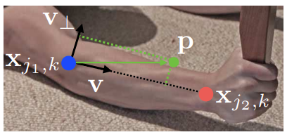

使$x_{j1,k}$和$x_{j2,k}$作为某人k的第c个身体肢体的两个真实身体部分$j1$和$j2$。如果点p在胳膊上，$L_{c,k}^{*}(p)$是一个单位向量从$j1$指向$j2$;对于其他的点，这个向量的值为0.

为了在训练过程中评估公式（5）中的$f_L$,我们定义了真实的亲和力向量，$L_{c,k}^{*}(p)$,在图像上的p点，可以表示为

$L_{c,k}^* = \begin{equation}
\left\{
             \begin{array}{lr}
            p {\ \   }if \ p \ on \ limb\ c,k , &  \\
		0 \ otherwise.\\
             \end{array}
\right.
\end{equation}$                                                                     (8)

这里，$v=(x_{j2,k} - x_{j1,k})/\parallel x_{j2,k}-x_{j1,k}\parallel_2$是肢体方向上的单位向量。肢体上的点定义为在指定阈值内的点，这些p点：

$0\le v \bullet (p - x_{j1,k}) \le l_{c,k}  \ and  \  \mid v_{\perp} \bullet (p-x_{j1,k})\mid \le \sigma_l$

肢体的宽度$\sigma_l$是像素距离，肢体的长度是$l_{c,k} = \parallel x_{j2,k}-x_{j1,k}\parallel_2$ ，$v_\perp$ 是垂直与v的向量。

真实的亲和力将图像上所有的人的亲和力做平均，

$L_{c}^*(p) = \frac {1} {n_c(p)} \sum _k L_{c,k}^*(p)$                                                                                   (9)

$n_c(p)$表示在p点的经过k个人的肢体c的非零向量 （不同人肢体重叠的像素的平均）

在测试时，我们通过计算连接候选身份部分位置的线积分来测量检测到的候选身体部分的连接。换句话说，我们测量PAF的对齐的线，即连接检测到的身体部分之间的线。特别地，对于两个候选的身体部位$d_{j1}$$d_{j2}$ ，我们将预测的部分亲和力简化，$L_c$ 沿着线分割去测量它们之间连接的可能性。

$E=\lmoustache_{u=0}^{u=1} L_c(p(u)) \bullet \frac {d_{j2}-d_{j1}} {\parallel d_{j2}-d_{j1}\parallel}_2 du$                                                                       (10)

p(u) 表示两个身体部位 $d_{j1}$ 和$d_{j2}$ 之间的位置：

$p(u) = (1-u) \bullet d_{j1} + ud_{j2}$										 (11)

**在实践中，我们通过抽样来估计积分求和的均匀间隔值**

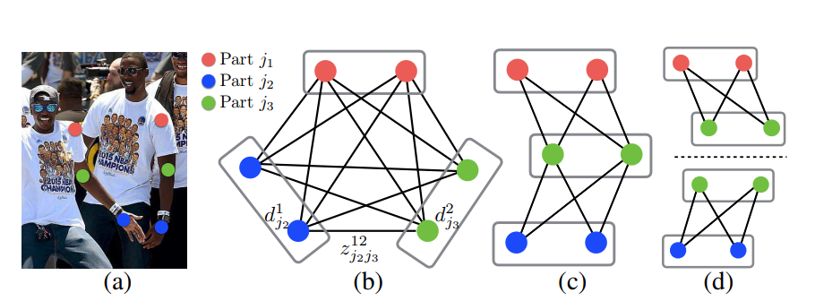

*Figure 6.图匹配。（a）带有检测出的身体部位的原图（b）K分图（c）树结构（d）一组二分图*

### 2.4. Multi-Person Parsing using PAFs

我们在检测的置信图上执行最大限制来获取一组离散的候选身体部位。对于每一个部位，我们可能有多个候选，因为图像上有多个人，或者误报（如Figure .6b所示）。这些候选的身体部位定义了一个很大的可能肢体集合。我们用公式 （10）中的线积分来计算每个候选肢体的得分。K分图的最优解析是被熟知的np问题（如Figure 6所示）。在这篇论文中，我们使用了一种贪婪的松弛方法，总是能够产生高质量的匹配。我们推测原因是成对的关联隐含着全局上下文，由于大的PAF感知网络。

正式地，我们首先得到一个多人的候选身体检测部位的集合$D_J$，$D_J = \{ d_j^m : for \ j \in \{1...J\},m \in \{1...N_j\}\}$,$N_j$代表身体部位j的候选个数，$d_j^m \in R^2$ 为身体部位j的第m个候选检测。这些检测的候选部位需要与同一个人的其他候选部位连接，换句话说，我们需要找到成对的身体检测，保证它们实际上是连接着的肢体。我们定义了一个变量 $z_{j1j2}^{mn} \in \{0,1\}$ 用来表示候选检测身体部位 $d_{j1}^m$ 和$d_{j2}^n$是否是真正的连接，目标是为了找到对于所有可能的连接的最佳匹配，$Z=\{ z_{j1j2}^{mn} : for \ j \in \{1...J\},m \in \{1...N_{j1}\},n \in \{1...N_{j2}\}\}$ .

如果我们考虑单独的第c个肢体的一对身体部位，$j1$和$j2$(例如颈部和右臀)，找到最佳匹配就简化成了一个二分图的最大匹配问题[32]。这种情况如图Figure 5b中所示。在这个图匹配的问题中，图上的节点都是候选的身体检测部位$D_{j1}$和$D_{j2}$,边是候选身体部位之间的全部可能的连接。另外，每一条边由公式（10）加权，即部分亲和力。二分图的一个匹配是找到一个子集，在子集中任意两条边没有公共点。我们的目标就是在被选择的变中找到一个拥有最大权值的匹配，

$max_{Z_c}E_c = max_{Z_c}\sum_{m\in D_{j1}} \sum _{n \in D_{j2}}E_{mn}\bullet z_{j1j2}^{mn} $                                     (12)

$s.t.             \forall m\in D_{j1} ,\sum _{n \in D_{j2}} z_{j1j2}^{mn}  \le 1,$                                                                (13)

$s.t.             \forall n\in D_{j2} ,\sum _{m \in D_{j1}} z_{j1j2}^{mn}  \le 1,$                                                                (14)

$E_c$是肢体c的匹配的总权值，$Z_c$是肢体c相对于$Z$的子集，$E_{mn}$是身体部分$d_{j1}^m$和$d_{j2}^n$之间的亲和力，如公式 （10）定义。公式（13）和公式(14)要求不存在有共同点的两条边，即不可能有同种类型的肢体的两个公用一个身体部位。我们可以用匈牙利算法[14]去获得一个最优匹配。

当遇到要找多人的全身身体姿势时，决定了$Z$是一个K分图匹配问题。这是一个np问题，有很多松弛方法存在。在我们的工作中，我们对最佳匹配添加了两个松弛，针对我们的问题。首先，我们选择最少数量的边来获得人体姿势的生成树骨架，如Figure 6c所示。其次,我们将寻找骨架匹配的问题分解卫了一组二分匹配的问题，并且规定相邻树节点中的匹配相互独立，如Figure 6d所示。我们在3.1节中显示了详细的比较结果，证明了是最小的计算成本并且贪心推理很好地近似逼近全局解决方案。原因是相邻树节点之间的关系被PAF显式建立，但在内部，不相邻的树节点之间由CNN隐式建模。出现这个性质的原因是CNN受到大的感知场训练，并且非相邻树节点的PAF也影响PAF的预测。

在有这两个松弛的情况下，优选可以简化为：

$max_{Z}E = \sum _{c=1}^C max_{Z_c}E_c$                                                                              （15）

## 3.Result

我们在两个指标上测试我们的方法在多人姿态检测：（1）MPII 人体多人数据集[2] (2)COCO2016人体关键点检测数据集[15]。这两个数据集收集的图像包含现实世界中很多挑战比如拥挤的人群，规模变化，遮挡，接触等等。我们的方法在首届COCO 2016关键点挑战上展示了最先进的技术[1]，并且超过以前MPII多人基准测试的最新结果。
我们还提供运行时分析来量化系统的效率。 图10显示了我们算法的一些定性结果。

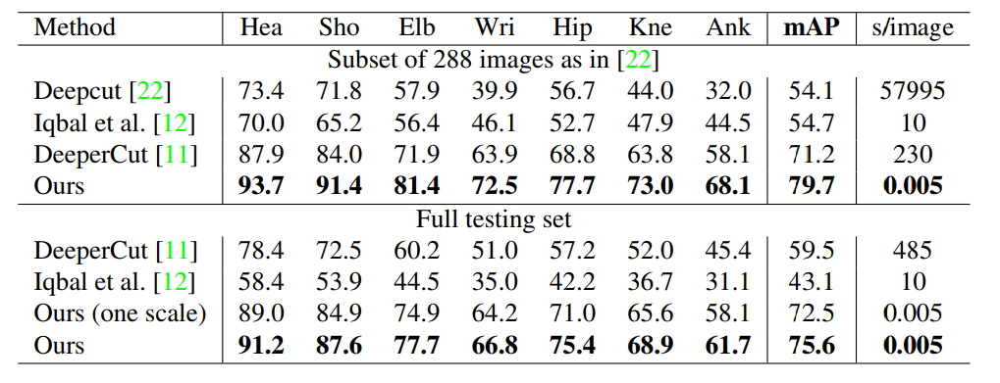

*Table1.在MPII数据集上的结果。顶部：在测试集上的结果对比。中间:在整个数据集上的对比。没有比例搜索的测试表示为“（一个比例）”。*

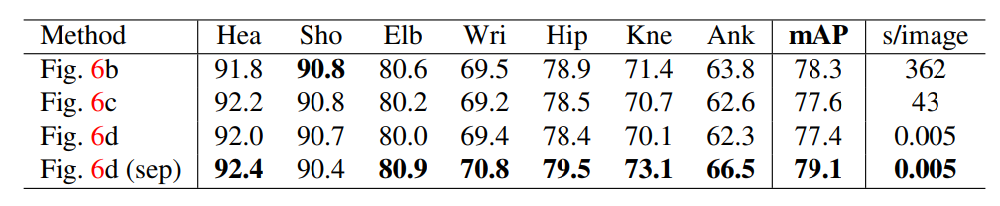

*表2.验证集上不同结构的比较*

### 3.1.Results on the MPII Multi-Person Dataset

为了比较MPII数据集，我们使用了工具包[22]测量了所有身体部位都基于PCKh的平均精度（mAP）阈值。表1比较了我们的方法和其他方法之间的在接近288个测试图像的相同子集[22]中mAP性能，和整个MPI测试集，以及在我们自己的验证集上的自我比较。除了这些措施，我们进行比较每个图像的平均推断/优化时间秒。对于288个图像子集，我们的方法优于以前最先进的自下而上的方法[11]超过8.5％mAP。值得注意的是，我们的推理时间是6倍指数幅度下降。我们在3.3节中介绍了更详细的运行时分析。对于整个MPII测试集，我们的没有比例搜索的方法已经优于以前的最先进的方法，即增加了绝对值为13％mAP。使用3比例搜索（×0.7，×1和×1.3）进一步将性能提高到75.6％mAP。该mAP与之前自下而上的方法比较表明我们使用PAF，用于关联身体部位新颖的特征表示的有效性。基于树形结构，我们基于完全连通的图切优化公式的贪婪的解析方法比直接使用整个图结构更准确。

在表2中，我们显示了不同的比较结果.在我们的验证集上如Figure6所示的骨架结构，即，从MPII训练集中排除的343个图像。 我们基于完全连通的图形训练我们的模型，并进行比较选择所有边缘的结果（Figure 6b，大约由整数线性规划求解）和最小树边界（Figure 6c，大致由线性规划解决）

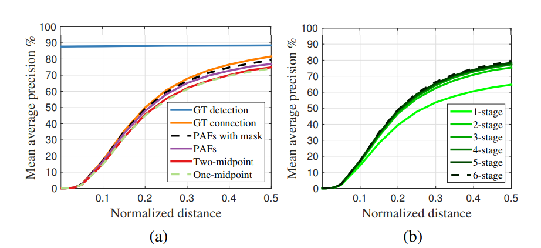

Figure 7. MPII验证时不同PCKh阈值上的mAP曲线组。 （a）自我比较实验的mAP曲线。（b）PAF跨阶段的mAP曲线。*

Figure 6d，通过在本文中所提出的贪婪算法求解）。 他们的相似表现表明使用最小边缘就足够了。 我们训练另一个模型只学习最小边缘以充分利用网络能力 - 本文提出的方法 - 即表示为Figure 6d（sep）。 该方法优于Figure -6c 甚至Figure 6b，同时保持效率。 原因是更少的连接（13个边的树木与91个边的树）相比更加容易收敛。

Figure 7a显示了我们在验证集上的的消融分析。对于PCKh-0.5的阈值，使用PAF的结果
优于使用中点表示的结果，具体来说，它比一个中点高出2.9％和2.3％高于两个中间点。编码
人的位置和四肢方向信息的 PAF，能更好地区分常见的交叉。例如，重叠的胳膊。用未标记的人
进行训练进一步提高了2.3％的表现，因为它避免了惩罚真正的积极预测在训练期间的损失。如果我们的解析算法使用真真实的关键点位置，我们可以获得一个88.3％的mAP。在Figure 7a中，我们使用GT检测进行解析的mAP
在不同的PCKh阈值之间保持不变，因为没有本地化错误，因此。使用我们的关键点的GT连接检测达到81.6％的mAP。值得注意的是我们的基于PAF的解析算法实现了类似使用GT连接（79.4％对81.6％）的mAP。这表明
基于PAF的解析在关联正确检测部分方面非常稳健。Figure 7b显示了跨阶段性能的比较。 mAP随着框架的不停优化单调增加。Figure 4显示了阶段预测的质量提高。

### 3.2. Results on the COCO Keypoints Challenge

COCO训练集包含超过10万人的实例标有超过100万个总关键点（即身体部分）。测试集包含“test-challenge”，“test-dev”和“test-standard”子集,每个子集大概有20K张图像。

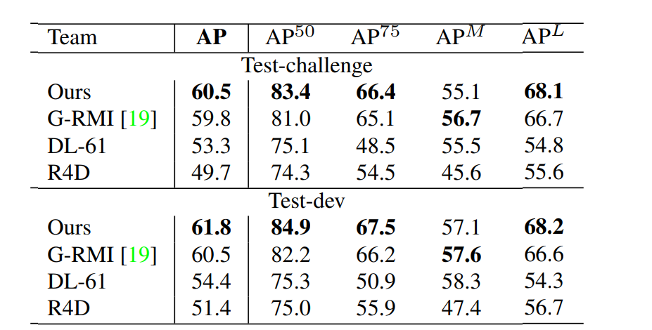

*Table 3. COCO 2016关键点挑战的结果。 上半部分：在测试集test-challenge中的结果。 下半部分：在test-dev的结果(只有最顶尖的方法的一些结果)。 $AP^{50}$是针对用于大规模人群，OKS = 0.5。$AP^L$是对于大规模人群来说的。*

COCO评估定义对象关键点相似性（OKS）并使用平均平均精度（AP）超过10个OKS阈值作为主要竞争指标
[1]。 OKS与对象中的IoU在目标检测中扮演的角色相同。 它是根据人的规模和预测点与GT点之间的距离来计算的。 Table 3显示挑战中顶级团队的结果。 值得注意的是我们的方法精度低于自上而下小规模人群的方法（$AP^M$） 原因是我们的方法必须处理更大的范围，图像中的所有人一次性获取。 相反，
自上而下的方法可以针对区域面积更大的情况重新调整每个检测到的补丁
，因此在较小的规模下退化更少。

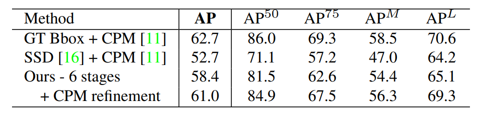

*Table4.在COCO验证集上做自我对比实验。*

在表4中，我们报告了在COCO验证集的自我比较，即随机选择的1160个图像。如果我们使用GT边界框和单个
人CPM [31]，我们可以实现上限使用CPM的自上而下方法，即62.7％的AP。如果我们使用最先进的物体探测器，单击多盒检测器（SSD）[16]，性能下降10％。该比较表明了自上而下方法的表现严重依赖人体探测器。相反，
我们自下而上的方法达到了58.4％的AP。如果在我们解析的每个人的重新调整的区域上应用单个人CPM改进了结果，我们获得了2.6％的整体AP增长。注意我们只更新两种方法的预测估计，符合得很好，导致精确率和召回率精度提高。我们预计更大规模的搜索可以进一步改善我们自下而上的方法的表现。Figure 8显示了一个我们的方法在COCO验证中的错误分解。大多数误报来自本地化不精确，除此以外还有背景混乱。这表明在捕捉空间方面比识别身体部位出现的机率方面有更多提升空间。

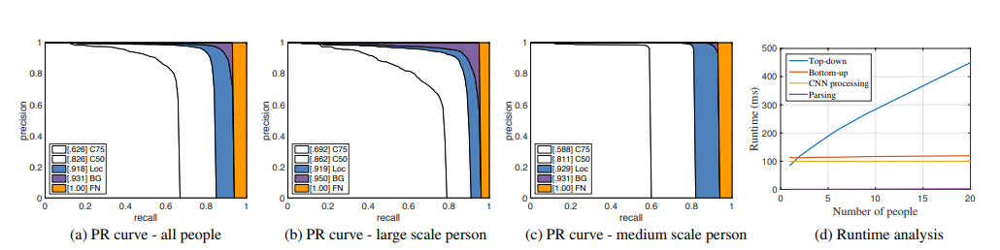

Figure 8.第3.2节（a），（b）和（c）中COCO验证的AP性能，以及3.3节（d）中的运行时分析。

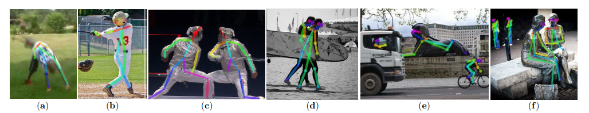

Figure 9.常见检测失败的情况：（a）罕见的姿势或外观，（b）缺失或错误的部件检测，（c）重叠部件，即部件检测由两个人共享，（d）与两个人的部分联系错误，（e-f）：对雕像或动物的误报

### 3.3. Runtime Analysis

为了分析我们方法的运行时性能，我们收集含有不同人数的视频。原本的帧大小为1080×1920，我们将其调整为368×654在测试期间调整到适合GPU内存大小。运行时分析是在配备一块NVIDIA GeForce GTX-1080 GPU的笔记本电脑上进行的。在Figure 8d中，我们使用人物检测和单人CPM作为自上而下的比较，它们运行时间大致与人数成正比。相比之下，我们自下而上的方法的运行时间随着人数的增加，增长相对缓慢。运行时间由两个主要部分组成：（1）CNN处理时间，其运行时复杂度为O（1），常量为不断变化的人数; （2）多人解析运行时复杂度为$O(n^2)$，其中n代表人数。但是，解析时间不会显着影响整体运行时间，因为它比CNN处理小两个数量级。例如，对于9个人来说，解析需要0.58毫秒，CNN需要99.6毫秒。我们的方法已经达到了一个19人的视频8.8 fps的效果。

## 4. Discussion

具有社会意义的时刻，比什么都重要，否则，迫使人们制作照片和视频。我们的照片集倾向于捕捉对于个人有意义的时刻：生日，婚礼，假期，朝圣，体育赛事，毕业典礼，家庭肖像等。为了使机器能够解释这些照片的重要性，
他们需要了解图片中的人。实时具有这种感知个人和社会行为的人的能力的机器将能够作出反应甚至参与其中。
在本文中，我们考虑了这一感知问题的关键组成部分：实时算法检测2D姿势图像中的多个人。我们提出了一个明确的非参数的通过编码人体四肢的位置和方向的关键点连接表示方法。第二，我们设计了一个身体部分检测和身体部分连接共同学习的一个架构。第三，我们证明了这一点贪婪的解析算法足以产生高质量甚至保持效率
身体姿态的检测，即使在随着图像中人数的增加的情况下依旧能保持。我们在Figure 9中展示了代表性失败案例。我们已公开发布我们的[代码](https://github.com/ZheC/Realtime_Multi-Person_Pose_Estimation)（包括经过训练的模型）确保完全可复现并鼓励在这一领域未来的研究。

## Acknowledgements

我们感谢MPII作者的努力和COCO人类姿势数据集。 这些数据集构使得人体2D姿态检测成为可能。 这项研究
由ONR Grants N00014-15-1-2358和N00014-14-1-0595提供支持。

## References

- [1]  MSCOCO keypoint evaluation metric  http://mscoco.org/dataset/##keypoints-eval 5, 6
- [2]  M. Andriluka, L. Pishchulin, P. Gehler, and B. Schiele. 2D human pose estimation: new benchmark and state of the art analysis. In CVPR, 2014. 5
- [3]  M. Andriluka, S. Roth, and B. Schiele. Pictorial structures
  revisited: people detection and articulated pose estimation.
  In CVPR, 2009. 1

*Figure 10.包含视点和外观变化，遮挡，拥挤，接触和其他常见成像伪像的结果*

- [4]  M. Andriluka, S. Roth, and B. Schiele. Monocular 3D pose estimation and tracking by detection. In CVPR, 2010. 1

- [5]  V. Belagiannis and A. Zisserman. Recurrent human pose estimation.In 12th IEEE InternationalConference and Workshops on Automatic Face and Gesture Recognition (FG),2017. 1
- [6]  A. Bulat and G. Tzimiropoulos. Human pose estimation via convolutional part heatmap regression. In ECCV, 2016. 1
- [7]  X. Chen and A. Yuille. Articulated pose estimation by a graphical model with image dependent pairwise relations. InNIPS, 2014. 1
- [8]  P. F. Felzenszwalb and D. P. Huttenlocher. Pictorial structures for object recognition. In IJCV, 2005. 1
- [9]  G. Gkioxari, B. Hariharan, R. Girshick, and J. Malik. Using k-poselets for detecting people and localizing their keypoints. In CVPR, 2014. 1
- [10]  K. He, X. Zhang, S. Ren, and J. Sun. Deep residual learning for image recognition. In CVPR, 2016. 1
- [11]  E. Insafutdinov, L. Pishchulin, B. Andres, M. Andriluka, and B. Schiele. Deepercut: A deeper, stronger, and faster multiperson pose estimation model. In ECCV, 2016. 1, 5, 6
- [12]  U. Iqbal and J. Gall. Multi-person pose estimation with local joint-to-person associations. In ECCV Workshops, Crowd Understanding, 2016. 1, 5
- [13]  S. Johnson and M. Everingham. Clustered pose and nonlinear appearance models for human pose estimation. In BMVC,
- [14] H. W. Kuhn. The hungarian method for the assignment problem. In Naval research logistics quarterly. Wiley Online Library,
- [15]  T.-Y. Lin, M. Maire, S. Belongie, J. Hays, P. Perona, D. Ramanan, P. Dollar, and C. L. Zitnick. Microsoft COCO: com- mon objects in context. In ECCV, 2014. 5
- [16]  W. Liu, D. Anguelov, D. Erhan, C. Szegedy, and S. Reed. Ssd: Single shot multibox detector. In ECCV, 2016. 6
- [17]  A. Newell, K. Yang, and J. Deng. Stacked hourglass networks for human pose estimation. In ECCV, 2016. 1
- [18]  W. Ouyang, X. Chu, and X. Wang. Multi-source deep learning for human pose estimation. In CVPR, 2014. 1
- [19]  G. Papandreou, T. Zhu, N. Kanazawa, A. Toshev, J. Tompson, C. Bregler, and K. Murphy. Towards accurate multi-person pose estimation in the wild. arXiv preprint arXiv:1701.01779, 2017. 1, 6
- [20]  T. Pfister, J. Charles, and A. Zisserman. Flowing convnets for human pose estimation in videos. In ICCV, 2015. 1
- [21]  L. Pishchulin, M. Andriluka, P. Gehler, and B. Schiele. Poselet conditioned pictorial structures. In CVPR, 2013. 1
- [22]  L. Pishchulin, E. Insafutdinov, S. Tang, B. Andres, M. Andriluka, P. Gehler, and B. Schiele. Deepcut: Joint subset partition and labeling for multi person pose estimation. In CVPR, 2016. 1, 5
- [23]  L. Pishchulin, A. Jain, M. Andriluka, T. Thormahlen, and ¨B. Schiele. Articulated people detection and pose estimation:Reshaping the future. In CVPR, 2012. 1
- [24]  V. Ramakrishna, D. Munoz, M. Hebert, J. A. Bagnell, and Y. Sheikh. Pose machines: Articulated pose estimation via inference machines. In ECCV, 2014. 1
- [25]  D. Ramanan, D. A. Forsyth, and A. Zisserman. Strike a Pose: Tracking people by finding stylized poses. In CVPR, 2005.1
- [26]  K. Simonyan and A. Zisserman. Very deep convolutionalnetworks for large-scale image recognition. In ICLR, 2015.2
- [27]  M. Sun and S. Savarese. Articulated part-based model for joint object detection and pose estimation. In ICCV, 2011. 1
- [28]  J. Tompson, R. Goroshin, A. Jain, Y. LeCun, and C. Bregler. Efficient object localization using convolutional networks. In CVPR, 2015. 1
- [29] J. J. Tompson, A. Jain, Y. LeCun, and C. Bregler. Joint training of a convolutional network and a graphical model for human pose estimation. In NIPS, 2014. 1
- [30]  A. Toshev and C. Szegedy. Deeppose: Human pose estimation via deep neural networks. In CVPR, 2014. 1
- [31]  S.-E. Wei, V. Ramakrishna, T. Kanade, and Y. Sheikh. Convolutional pose machines. In CVPR, 2016. 1, 2, 3, 6
- [32]  D. B. West et al. Introduction to graph theory, volume 2. Prentice hall Upper Saddle River, 2001. 4, 5
- [33]  Y. Yang and D. Ramanan. Articulated human detection with
  flexible mixtures of parts. In TPAMI, 2013. 1

## 笔记

[框架结构](https://blog.csdn.net/qq_36165459/article/details/78322184)

### Hungarian algorithm

## 代码

## 资料

[相关git仓库]()

### mAP的概念

1.对于某个类别C，在某一张图片上

首先计算C在一张图片上的Precision=在一张图片上类别C识别正确的个数（也就是IoU>0.5）/一张图片上类别C的总个数

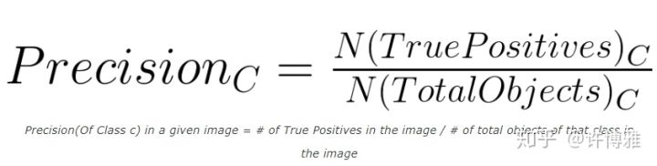)

2.依然对于某个类别C，可能在多张图片上有该类别，下面计算类别C的AP指数：

AP=每张图片上的Precision求和/含有类别C的图片数目

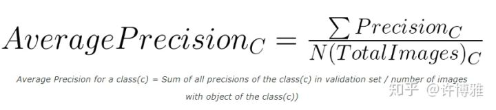

3.对于整个数据集，存在多个类别C1、C2、C3：mAP=上一步计算的所有类别的AP和/总的类别数目,相当于所有类别的AP的平均值

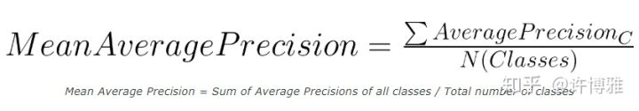

## 问题

Hungarian algorithm算法具体内容？

研究，fine tune openpose code

**在这里，我们在空间上对损失函数进行加权，以解决一些实际问题，即某些数据集并未完全标记所有人。**？？？

如果点p在胳膊上，$L_{c,k}^{*}(p)$是一个单位向量从$j1$指向$j2$;对于其他的点，这个向量的值为0.？？？？

我们使用了一种贪婪的松弛方法？？

We speculatethe reason is that the pair-wise association scores implicitly
encode global context, due to the large receptive field of the
PAF network.？？

二分图最大匹配？

匈牙利算法？？？

The reason is that the relationship between adjacent tree nodes is modeled explicitly by PAFs, but internally, the relationship between nonadjacent tree nodes is implicitly modeled by the CNN. This property
emerges because the CNN is trained with a large receptive field, and PAFs from non-adjacent tree nodes also influence the predicted PAF？？？

什么是scale search？

GT points？？？

