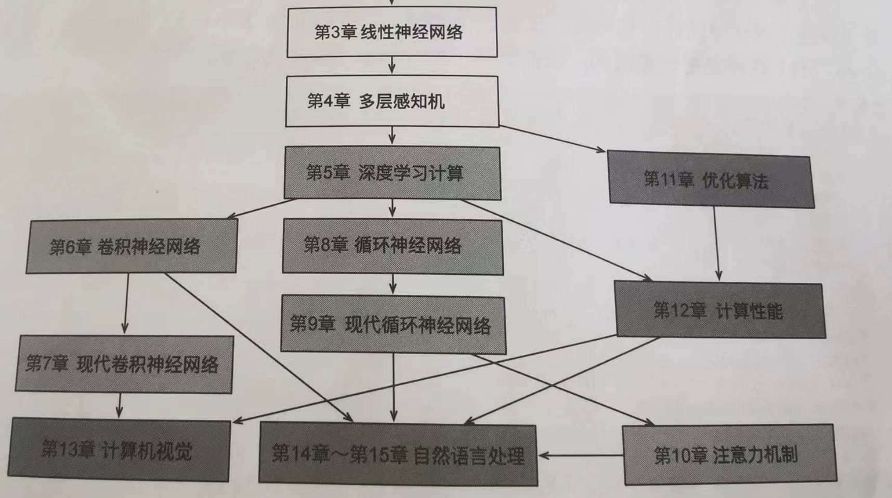

# 书籍脉络

- 理论基础：求导、反向传播、梯度下降、线性代数（矩阵运算那些）
    - 线性回归
        - softmax解决分类问题
            - 多层感知机：解决复杂问题、更多的层
                - 激活函数：避免多层感知机退化成线性回归
                    - 权重衰减、暂退法：解决过拟合问题，思路是改变或删减隐藏层权重数量。暂退法是向前传播时在激活函数之后加上一层
                        - 参数初始化或者优化期间的适当正则化，解决梯度消失，梯度爆炸，打破对称性等问题。
                        - 分布偏移（训练数据与测试数据分布不同，环境变化也是特征的一部分，预测结果概念在不同地方含义不同），均有对应解决方法（书里的公式没看懂）：todo_rzc
                            - Kaggle比赛
                            - 预处理技巧：1. 缺失值替换为平均值。2. 将特征重新缩放到零均值和单位方差来标准化数据（x-均值除以方差）3. 对于离散的分类，可以使用one-hot编码
                                - 卷积：提取输入的结构信息，**降低神经网络参数数量**。在卷积的背景下，引入了以下概念：通道（图像RGB三通道）。卷积核（本质也是权重）。填充（处理边界的卷积计算，增加输出的宽高）。步幅（减少参数，减低输出的宽高，提高泛化能力）。1x1卷积层（用于改变通道数，控制模型复杂性）。汇聚层(也叫池化层，降低层的宽高，聚合信息，一般有最大汇聚和平均汇聚)
                                    - 卷积神经网络（详细代码抄一下书上的即可）
                                        - LeNet:先卷积->汇聚->全连接
                                            - AlexNet: 比LeNet增加了更多的卷积层和参数，来拟合更大的数据集
                                            - VGG: 提出了VGG块的概念
                                            - NiN块: 由一个卷积层和多个1x1卷积层组成。去掉了最后的全连接，替换为了全局平均汇聚，所有位置求和取平均
                                            - GoogleNet: 提出了Inception块，相当于一个有4条路径的子网络，不同的子网络拥有不同窗口形状的卷积层和最大汇聚层并行提取信息。
                                            - 批量规范化：加速网络的收敛和拟合
                                                - ResNet: 保证了深层网络，新添加层可以提升网络性能
                                                - DenseNet: 改良版的ResNet，ResNet的逻辑扩展 
                                    - 循环神经网络：上一次预测的结果，作为下一次预测的输入的一部分。
                                        - 文本预处理：1. 将文本作为字符串加载到内存中，2. 将字符串拆分为词元（如单词或字符）3. 建立一个词表，将拆分的词元映射到数字索引4. 将文本转化为数字索引序列，以方便模型操作
                                        - 一些基本概念：语料库，词元 token,未知词元<unk>，填充词元<pad>, 序列开始词元<bos>，序列结束词元<eos>
                                        - 词元化：有用字符的，也有用单词的
                                        - 语言模型的目标是估计序列的联合概率
                                        - 隐马尔可夫模型
                                        - 齐普夫定律，说明拉普拉斯平滑不适合语言建模
                                        - 预测与评估的方法：用序列去预测下一个词，因为词被词元化为了索引，可以转化为概率去评估预测的准不准
                                            - 困惑度：常用于评估语言模型的质量
                                        - 隐状态：捕获并保留了序列知道其当前时间步的历史信息，就如当前时间步中神经网络的状态或记忆。
                                        - 训练不足的模型是无法正确地拟合数据的
                                        - 由于循环神经网络的上一步输出用到下一步输入，因此在梯度更新时，链条非常长，很容易梯度爆炸或梯度消失，有一些解决的方法，例如梯度截断。
                                        - 现代循环神经网路
                                            - 为了解决这三个问题：1. 早期观测值对预测未来观测值具有非常重要的意义。最好有一种机制再一个记忆元里存储重要的早期信息。2. 一些词元没有相关的观测值，需要有一些机制跳过隐状态中的此类词元 3. 序列的各个部分之间存在逻辑上的中断，最好有一种方法来重置内部状态的状态表示。
                                                - 门控循环单元（GRU）,长短记忆网络(LSTM)：其实就是在隐状态中加了几个新变量，控制隐状态的生成变化逻辑。
                                                    - 深度循环神经网络：有很多隐藏层的循环神经网络
                                                    - 双向循环神经网络：可以拿后面的序列预测前面的序列
                                        - 常见应用：序列转换（机器翻译）
                                            - 编码器-解码器架构：编码器就是把原始序列映射为某个固定长度的状态，解码器把固定长度的状态映射为新的序列，编码器和解码器都是循环神经网络，解码器最后挂一个全连接层用来评估结果，算概率。常见的评估方法BLEU。
                                                - 优化的方法：束搜索


                                                        


# 基础概念

超参数：
1. 学习率
    1. 通常的，在训练网络的前期过程中，会选取一个相对较大的学习率以加快网络的收敛速度。而随着迭代优化的次数增多，逐步减小学习率，以保证最终收敛至全局最优解，而不是在其附近震荡或爆炸。几种常用的学习率衰减方法（todo_rzc: 学习一下）：
        - 分段常数衰减
        - 指数衰减
        - 自然指数衰减
        - 多项式衰减
        - 间隔衰减
        - 多间隔衰减
        - 逆时间衰减
        - Lambda衰减
        - 余弦衰减
        - 诺姆衰减
        - loss自适应衰减
        - 线性学习率热身
2. epoch
    1. epoch调优的技巧，reference: https://www.27ka.cn/39160.html
        1. 概念： 在深度学习中，一个epoch表示所有训练样本都被送入网络中进行了一次训练
        2. 设置合理的batch size：batch size是指每次迭代所选取的样本数，**对于大型数据集，我们通常会使用小batch size来加速训练。而对于小型数据集，通常使用大batch size能够更好地利用硬件加速。**调整batch size的大小可以帮助我们更好地利用GPU并行计算的优势，从而加速训练过程。
        3. 合理使用学习率调整策略：学习率是指模型在权重更新时所采用的参数更新速度。合理的学习率可以使模型更快地收敛，并提高模型的准确率。当模型的学习率过高或过低时，都可能导致模型的训练效果无法得到充分发挥。常用的学习率调整策略有：
            - 按步数调整
            - 按指数调整
            - 余弦退火调整等。
        4. 使用合适的正则化方法（todo_rzc: 什么是正则化：reference: https://blog.csdn.net/qq_43966129/article/details/123029320）：防止过拟合。在进行epoch调优时，我们通常使用L1或L2正则化来限制网络的权重，避免过拟合现象的发生。
            - 早停技术是指在模型出现过拟合时（测试集表现开始下降）停止训练。
            - 正则化技术是指通过向损失函数添加惩罚项来限制模型参数的大小，从而减少过拟合
        5. 增加数据集的多样性
        6. 合理选择损失函数：损失函数是评价模型优劣的一个重要指标，选用合适的损失函数可以使模型收敛更快并提高准确率。在epoch调优过程中，我们需要根据实际情况选择合适的损失函数。常用的损失函数：
            - 均方误差（MSE）
            - 交叉熵（Cross Entropy）
                - 交叉熵损失函数定义了log函数。当模型预测概率为0时，log函数的值为负无穷。因此，在实际计算时，通常忽略预测概率接近0的样本对损失函数的贡献。这可能会导致模型欠拟合，并且在训练过程中难以收敛。
                    - 解决方法是使用PyTorch框架中实现的交叉熵损失函数torch.nn.CrossEntropyLoss
            - 对数损失
3. batch_size
4. 其他：初始参数？（todo_rzc: 初始参数可能不算超参数？）
5. 权重初始化的方法
    1. torch.nn.init.uniform_(tensor, a=0, b=1) 服从均匀分布U(a, b)
    2. torch.nn.init.normal_(tensor, mean=0, std=1) 服从~ 正态分布N(mean,std)
    3. torch.nn.init.constant_(tensor, val) 初始化为常数
    4. torch.nn.init.xavier_uniform_(tensor, gain=1) 均匀分布 ~ U(−a,a)Xavier基本思想是通过网络层时，输入和输出的方差相同，包括前向传播和后向传播。 看起来是搭配sigmoid激活函数使用的。reference: https://blog.csdn.net/luoxuexiong/article/details/95772045
    5. torch.nn.init.xavier_normal_(tensor, gain=1) 正态分布~N(0,std)


- one-hot-encoding: 独热编码，假如有三个类别{猫，鸡，狗}，标签y将是一个三维向量，其中(1,0,0)表示猫，(0,1,0)表示鸡，(0,0,1)表示狗

- 最大似然估计与损失函数：
    - https://www.zhihu.com/question/27126057
    - https://blog.csdn.net/qq_27690765/article/details/107530899
- softmax损失函数


关于模型蒸馏：

模型蒸馏是一种用于训练和优化深度神经网络模型的技术。它的思想是通过将一个复杂的模型（称为教师模型）的知识转移给另一个简化的模型（称为学生模型），从而提高学生模型的性能。

在模型蒸馏中，教师模型通常是一个在大规模数据集上训练过的复杂模型，具有较高的准确性和表达能力。学生模型则是一个简化的模型，通常使用浅层网络结构或较少的参数。通过将教师模型的输出（即软目标）作为学生模型的训练标签，并结合学生模型自身的训练数据（即硬目标），可以使学生模型更好地学习到教师模型的知识。

模型蒸馏的目的是在保持学生模型的简洁性的同时，提高其性能和泛化能力。通过蒸馏，学生模型可以学习到教师模型的一些“软”标签，这些标签包含了教师模型在训练数据上的不确定性和置信度信息，有助于提高学生模型的鲁棒性和泛化能力。

模型蒸馏可以应用于许多任务和领域，包括图像分类、目标检测、语音识别等。它已被广泛应用于深度学习领域，并取得了显著的性能提升和模型压缩效果。

多层感知机，引入了激活函数，解决了多层网络还是线性神经网络的问题。常见的激活函数：
- RELU
- sigmoid
- tanh


查看相关的pytorch权重初始化函数 print(dir(torch.nn.init))


# 代码示例

## 线性回归
定义一个线性回归的模型,第一个参数2是输入特性的形状，第二个参数指定输出形状，输出形状为标量，则为1。

nn是神经网络的意思。

```
from torch import nn
net = nn.Sequential(nn.Linear(2, 1))
```
一个pytorch线性神经网络示例：
```
import numpy as np
import torch
import d2l
from torch.utils import data

# 预定义一组答案参数
true_w = torch.tensor([2, -3.4]) # 2 * 1
true_b = 4.2

# 随机生成数据，加上噪声，噪声符合正态分布
def synthetic_data(w, b, num_examples):
    X = torch.normal(0, 1, (num_examples, len(w))) # 1000 * 2
    y = torch.matmul(X, w) + b
    y += torch.normal(0, 0.01, y.shape)
    return X, y.reshape((-1, 1))
features, labels = synthetic_data(true_w, true_b, 1000)

# 训练的时候取batch批量数据
def load_array(data_arrays, batch_size, is_train=True):
    """构造一个PyTorch数据迭代器"""
    dataset = data.TensorDataset(*data_arrays)
    return data.DataLoader(dataset, batch_size, shuffle=is_train)
batch_size = 10
data_iter = load_array((features, labels), batch_size)
next(iter(data_iter))

# 定义线性回归神经网络
from torch import nn
net = nn.Sequential(nn.Linear(2, 1))

# 初始化神经网络参数
net[0].weight.data.normal_(0, 0.01)
net[0].bias.data.fill_(0)

# 定义神经网络的损失函数
loss = nn.MSELoss() # L2范数
# loss = nn.MSELoss(reduction='mean') # 小批量损失的平均值
# loss = nn.SmoothL1Loss(reduction='mean') # 胡伯尔损失

# 定义优化算法（这里用的小批量随机梯度下降算法）# todo_rzc: 啥意思
trainer = torch.optim.SGD(net.parameters(), lr=0.03)

# 定义训练几轮，每轮把所有数据训练一遍
num_epochs = 10
for epoch in range(num_epochs):
    for X, y in data_iter:
        l = loss(net(X), y)
        trainer.zero_grad() # todo_rzc: 啥意思
        l.backward()
        trainer.step()
    l = loss(net(features), labels)
    print(f'epoch {epoch + 1}, loss {l: f}')

# 打印训练结果与答案的偏差
w = net[0].weight.data
print('w的误差：', true_w - w.reshape(true_w.shape))
b = net[0].bias.data
print('b的误差：', true_b - b)
# print(dir(nn)) # 打印nn的函数
# help(nn.BCELoss) # 打印用法

# net[0].weight.grad,net[0].bias.grad # 访问梯度
```

pytorch的其他优化器算法：（todo_rzc）: https://zhuanlan.zhihu.com/p/64885176

## 图像分类

从0实现softmax回归，图像分类:

```
class Animator:  #@save
    """在动画中绘制数据"""
    def __init__(self, xlabel=None, ylabel=None, legend=None, xlim=None,
                 ylim=None, xscale='linear', yscale='linear',
                 fmts=('-', 'm--', 'g-.', 'r:'), nrows=1, ncols=1,
                 figsize=(3.5, 2.5)):
        # 增量地绘制多条线
        if legend is None:
            legend = []
        d2l.use_svg_display()
        self.fig, self.axes = d2l.plt.subplots(nrows, ncols, figsize=figsize)
        if nrows * ncols == 1:
            self.axes = [self.axes, ]
        # 使用lambda函数捕获参数
        self.config_axes = lambda: d2l.set_axes(
            self.axes[0], xlabel, ylabel, xlim, ylim, xscale, yscale, legend)
        self.X, self.Y, self.fmts = None, None, fmts

    def add(self, x, y):
        # 向图表中添加多个数据点
        if not hasattr(y, "__len__"):
            y = [y]
        n = len(y)
        if not hasattr(x, "__len__"):
            x = [x] * n
        if not self.X:
            self.X = [[] for _ in range(n)]
        if not self.Y:
            self.Y = [[] for _ in range(n)]
        for i, (a, b) in enumerate(zip(x, y)):
            if a is not None and b is not None:
                self.X[i].append(a)
                self.Y[i].append(b)
        self.axes[0].cla()
        for x, y, fmt in zip(self.X, self.Y, self.fmts):
            self.axes[0].plot(x, y, fmt)
        self.config_axes()
        display.display(self.fig)
        display.clear_output(wait=True)
```

```
# 用softmax是因为要用概率评估分类
# 定义超参
batch_size = 256
lr = 0.1
num_epochs = 10

# 加载数据
def get_dataloader_workers():
    return 4

import torch
import torchvision
from torch.utils import data
from torchvision import transforms # 做图像变换
from IPython import display
from d2l import torch as d2l
def load_data_fashion_mnist(batch_size, resize=None):
    trans = [transorms.ToTensor()]
    if resize:
        trans.insert(0, transforms.Resize(resize)) # 其实是transform的多个步骤，先toTensor，然后resize
        trans = transforms.Compose(trans) # 组合之前的步骤
        mnist_train = torchvision.datasets.FashionMNIST(# tran=True,下载的数据命名会加上train
            root="../data", train=True, transform=trans, download=True
        )
        mnist_test = torchvision.datasets.FashionMNIST(
            root="../data", train=False, transform=trans,download=True
        )
        return (data.DataLoader(mnist_train, batch_size, shuffle=True, num_workers=get_dataloader_workers()),
               data.DataLoader(mnist_test, batch_size, shuffle=False, num_workers=get_dataloader_workers())
               )

num_inputs = 784 # 每个图像大小 28 * 28= 784像素，可以看做784长度的向量
num_outputs = 10 # 10个类别
# 定义初始权重
W=torch.normal(0, 0.01, size=(num_inputs, num_outputs), requires_grad=True) # 权重即为784 * 10矩阵
b=torch.zeros(num_outputs, requires_grad=True) # 偏置为1 * 10 行向量
# 定义神经网络模型
def softmax(X):
    X_exp = torch.exp(X)
    partition = X_exp.sum(1, keepdim=True) # 每行求和
    return X_exp / partition # 这里应用到了广播机制
def net(X):
    return softmax(torch.matmul(X.reshape((-1, W.shape[0])), W) + b)
# 定义损失函数
def cross_entropy(y_hat, y):
    return - torch.log(y_hat[range(len(y_hat)), y])
def accuracy(y_hat, y):
    """计算预测正确的数量"""
    if len(y_hat.shape) > 1 and y_hat.shape[1] > 1:
        y_hat = y_hat.argmax(axis = 1)
    cmp = y_hat.type(y.dtype) == y
    return float(cmp.type(y.dtype).sum())
def evaluate_accuracy(net, data_iter):
    """计算在指定数据集上模型的精度"""
    if isinstance(net, torch.nn.Module):
        net.eval() # 将模型设置为评估模式,停止反向传播
    metric = Accumulator(2)
    with torch.no_grad():#,停止反向传播
        for X, y in data_iter:
            metric.add(accuracy(net(X), y), y.numel())
    return metric[0] / metric[1]
class Accumulator:
    def __init__(self, n):
        self.data = [0.0] * n
    def add(self, *args):
        self.data = [a + float(b) for a, b in zip(self.data, args)]
    def reset(self):
        self.data = [0.0] * len(self.data)
    def __getitem__(self, idx):
        return self.data[idx]
# 定义优化算法
# 定义训练函数
def train_epoch_ch3(net, train_iter, loss, updater):
    """训练模型一轮"""
    # 将模型设置为训练模式
     if isinstance(net, torch.nn.Module):
        net.train()
    # 训练损失总和、训练准确度总和、样本数
    metric = Accumulator(3)
    for X, y in train_iter:
        # 计算梯度并更新参数
        y_hat = net(X)
        l = loss(y_hat, y)
        if isinstance(updater, torch.optim.Optimizer):
            # 使用pytorch内置的优化器和损失函数
            updater.zero_grad()
            l.mean().backward()
            updater.step()
        else:
            # 使用定制的优化器和损失函数
            l.sum().backward()
            updater(X.shape[0])
        metric.add(float(l.sum()), accuracy(y_hat, y), y.numel())
    # 返回训练损失和训练精度
    return metric[0] / metric[2], metric[1] / metric[2]
def train_ch3(net, train_iter, test_iter, loss, num_epochs, updater):
    """训练模型多轮"""
    animator = Animator(xlabel='epoch', xlim=[1, num_epochs], ylim=[0.3, 0.9],
                        legend=['train loss', 'train acc', 'test acc'])
    for epoch in range(num_epochs):
        train_metrics = train_epoch_ch3(net, train_iter, loss, updater)
        test_acc = evaluate_accuracy(net, test_iter)
        animator.add(epoch + 2, train_metrics + (test_acc,))
    train_loss, train_acc = train_metrics

def updater(batch_size):
    return d2l.sgd([W, b], lr, batch_size)
train_ch3(net, train_iter, test_iter, cross_entropy, num_epochs, updater)
```
```
# 预测，评估准确率
def predict_ch3(net, test_iter, n=6):  #@save
    """预测标签（定义见第3章）"""
    for X, y in test_iter:
        break
    trues = d2l.get_fashion_mnist_labels(y)
    preds = d2l.get_fashion_mnist_labels(net(X).argmax(axis=1))
    titles = [true +'\n' + pred for true, pred in zip(trues, preds)]
    d2l.show_images(
        X[0:n].reshape((n, 28, 28)), 1, n, titles=titles[0:n])

predict_ch3(net, test_iter)
```

softmax的简化实现：
```
import torch
from torch import nn
from d2l import torch as d2l
# 定义超参数
batch_size = 256
num_epochs = 10
train_iter, test_iter = d2l.load_data_fashion_mnist(batch_size)
# 定义展平层来调整网络输入的形状
net = nn.Sequential(nn.Flatten(), nn.Linear(784, 10))
# 定义初始权重
def init_weights(m):
    if type(m) == nn.Linear:
        nn.init.normal_(m.weight, std=0.01)
net.apply(init_weights)
# 定义损失函数
loss = nn.CrossEntropyLoss(reduction='none')
# 定义优化算法
trainer = torch.optim.SGD(net.parameters(), lr=0.1)
# 训练
d2l.train_ch3(net, train_iter, test_iter, loss, num_epochs, trainer)
# 预测
d2l.predict_ch3(net, test_iter)
```
# question
1. 为什么神经网络只有一个隐藏层，给定足够的神经元和正确的权重，就可以对任意函数建模？ 书4.1.1结尾
2. 证明一个仅使用ReLU或pRELU的多层感知机构造了一个连续的分段线性函数？书4.1.1练习
2. 论文阅读
- [ ] openpose论文
- [ ] Llama2论文
- [ ] Natural Speech2论文
- [ ] InstructGPT论文

# 代码技巧
[代码技巧](./代码技巧.md)